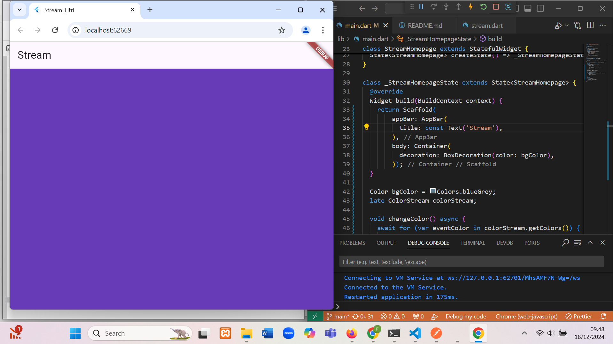
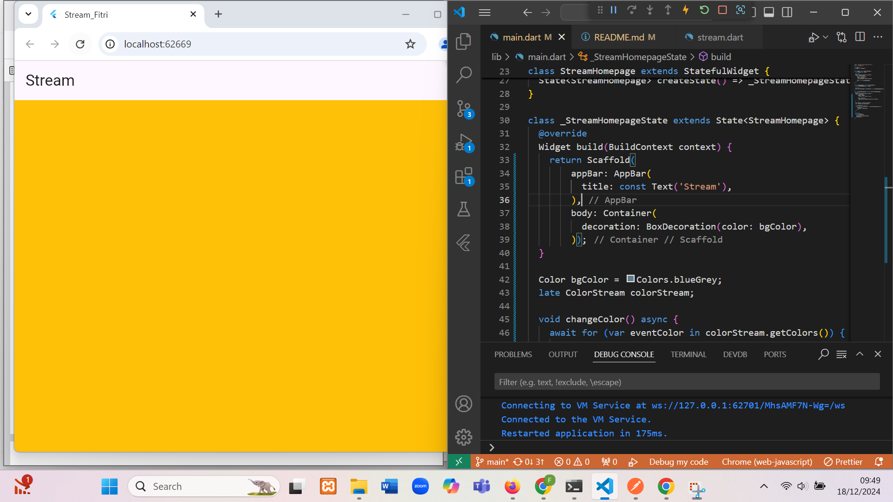
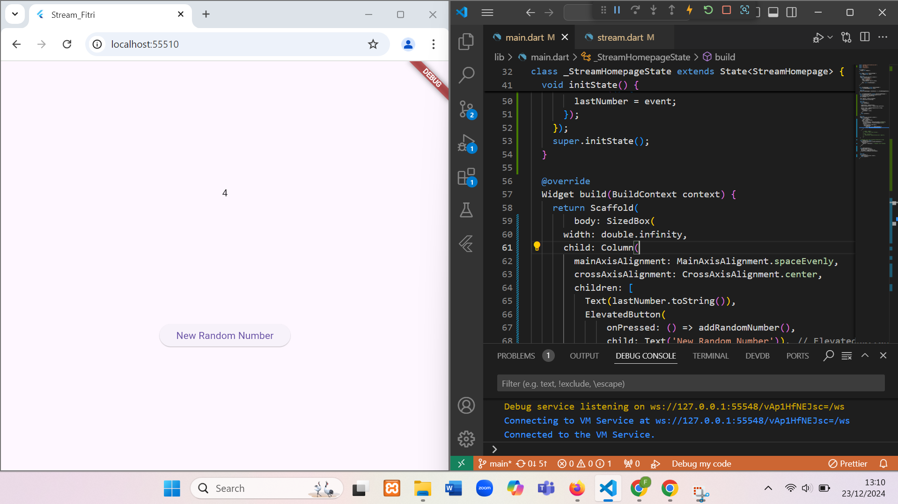

Nama: Fitria ayu Pratiwi
NIM: 362358302016
Kelas: 2B TRPL

W13: Jawaban Soal 3
Jelaskan fungsi keyword yield\*
digunakan untuk meneruskan nilai dari stream yang dihasilkan oleh Stream.periodic

Apa maksud isi perintah kode tersebut?
Setiap detik, stream akan mengeluarkan warna satu per satu dari daftar colors.Warna akan terus dipilih berdasarkan waktu detik (t), dan ketika mencapai akhir daftar (10 warna), proses akan berulang dari awal.

W13: Jawaban Soal 4

W13: Jawaban Soal 5
listen() digunakan untuk mendengarkan stream dan mengeksekusi callback setiap kali stream menghasilkan data baru
await for adalah cara untuk secara asinkron "menunggu" data yang dihasilkan oleh stream dan secara otomatis mengiterasi semua data yang diterima oleh stream

soal 6
Jelaskan maksud kode langkah 8 dan 10
langkah 8: menginisialisasi stream untuk mendengarkan data secara asinkron, dan memperbarui antarmuka pengguna (UI) setiap kali data baru diterima.

langkah 10: menghasilkan angka acak dan mengirimkan angka tersebut ke dalam stream

